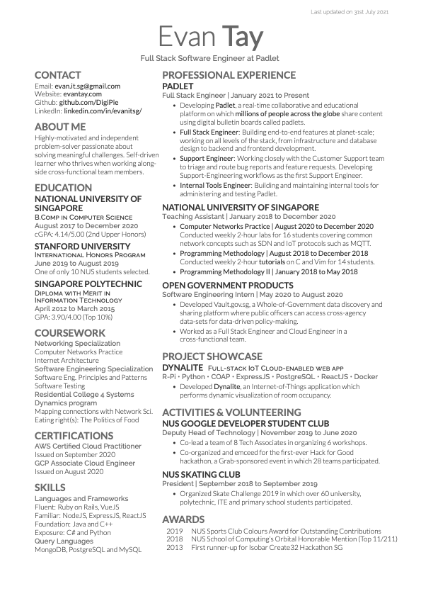

Deedy-Resume-Minimal
=========================

A **one-page**, **two-column** resume template in **XeTeX** meant for you if you are an **undergraduate**  applying for an internship or first job in the tech industry, where single-page resumes are highly preferred or sometimes an outright requirement.

It is most suitable for students majoring in Computer Science, Data Analytics, Information Systems and other IT-related majors.

## Motivation

Common LaTeX resume-builders such as [**moderncv**](http://www.latextemplates.com/template/moderncv-cv-and-cover-letter)  and the [**friggeri-cv**](https://github.com/afriggeri/cv) look great if you are looking for a multi-page resume, but these templates are usually imperfect for building a single-page one. The original [**deedy-resume**](https://github.com/deedy/Deedy-Resume) was created to address this specific use case.

Like the original [**deedy-resume**](https://github.com/deedy/Deedy-Resume), this **deedy-resume-minimal** variant is built with a **minimalistic** and **clean one-page design** which can be easily edited using **XeTeX**.

The only key difference between the original [**deedy-resume**](https://github.com/deedy/Deedy-Resume) and this variant as of now is the removal of the contact details below the name, given that it already appears under the Contact section. Other inconsequential edits include removing the line break and change in header font as a matter of preference.

## Preview

## Dependencies

1. Compiles only with **XeTeX** and not **pdfLaTeX**
2. Requires **BibTex** for compiling publications and the `.bib` filetype

## Getting started on Overleaf

If you are new to LaTeX and do not wish to install and set up LaTeX locally, you can use Overleaf, an online LaTeX editor that is easy to use. 

It has GitHub integration which allows you to import a repo from GitHub directly into Overleaf for online editing. You can also sync and commit changes made within Overleaf to your own repo.

### Setup
1. Fork this repo
1. Visit [www.overleaf.com](https://www.overleaf.com) and sign up for an account
1. Import your repo: _New Project > Import from GitHub_
    - You will need to grant Overleaf access to your GitHub account
1. Import your forked repo
1. **Change the compiler:** _Menu > Settings > Compiler > XeLaTeX_
    - The default compiler **pdfLaTeX** cannot compile this resume
1. Add your own resume content to `resume.tex`
1. Update `resume-template.cls` if you want to change the resume design
1. Download your resume: _Download PDF (right of the Recompile button)_

### Sync and update GitHub repo

If you wish to commit changes made within Overleaf to your GitHub repo or to sync Overleaf with your repo: 
- Sync: _Menu > Settings > Sync > GitHub_ 

## Known issues
1. Overflows onto second page if vertical limit is exceeded
1. Hacky space on the first bullet point on the second column

## License
    Copyright 2014 Debarghya Das

    Licensed under the Apache License, Version 2.0 (the "License");
    you may not use this file except in compliance with the License.
    You may obtain a copy of the License at

       http://www.apache.org/licenses/LICENSE-2.0

    Unless required by applicable law or agreed to in writing, software
    distributed under the License is distributed on an "AS IS" BASIS,
    WITHOUT WARRANTIES OR CONDITIONS OF ANY KIND, either express or implied.
    See the License for the specific language governing permissions and
    limitations under the License.
